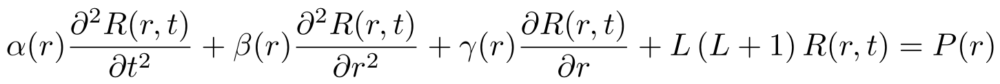
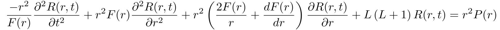

# Wave-like equation solver for singular spacetimes

## Description

General solver of the non-homogeneous Partial Differential Equation with singular points:

Implemented and tested only for equations of form:

    
As long as the Fourier transform of boundary conditions (r = r_0, t) exists. Uses scipy.solve_ivp back-end.
The solver uses Frobenius method to bypass singular points in the "r" coordinate, even when the solution to the PDE is discontinuous.

## Characteristics
- The most important characteristic is that it can solve beyond one or more singular points in the spacelike coordinate that make the solution discontinuous, like black hole event horizons, as long as the equation remains regular (see Frobenius method).
- F(r) is the metric function g_tt, this PDE is obtained by applying separation of variables to the General Relativity D'alembertian. This allows modelling scalar fields in Schwarzschild, Hayward, Reissner-Nördstrom, etc, backgrounds.
- Can read a JSON file containing the exact solution to the problem, if known, in order to facilitate testing. This file can be generated in Maple. Schwarzschild exact solutions can often be found.

## Usage
Logic and behavior is documented in the solver file.
Detailed guide of usage is included in the file "Example.py"
For testing, "Example.json" contains the exact solution to this problem with: F(r) = 1-2/r, P(r) = 81*r**2, L=1
Finally, "Example.mw" is a Maple worksheet explaining how to find initial conditions and export the exact solution so that it is read by the solver.

## Limitations
- Scipy.solve_ivp becomes inaccurate for large L ( >= 4)
- Strange inconsistency when doing the linear combination of 2 independent Frobenius solutions. Sometimes you need to take the complex conjugate of the Frobenius solutions and sometimes you don't. THE CODE HANDLES THIS EMPIRICALLY ACCORDING TO TESTS WITH KNOWN SOLUTIONS, MAY CAUSE INACCURATE SOLUTIONS.

